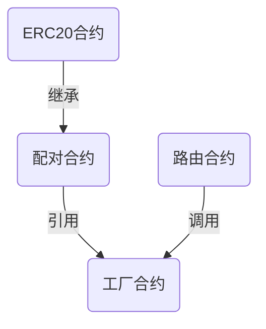

# 部署Uniswap交易所


## 准备Uniswap合约源码


### 源码结构


> Uniswap在Github上面开源了全部合约代码,其中包括`核心合约`,`周边合约`两部分.Uniswap还开源了前端代码,前端代码使用React开发


- [核心合约](https://github.com/Uniswap/uniswap-v2-core)


- [周边合约](https://github.com/Uniswap/uniswap-v2-periphery)


- [前端代码](https://github.com/Uniswap/uniswap-interface)


> 在Uniswap的核心代码中,主要包含3个合约:`工厂合约`,`配对合约`,`ERC20合约`.其中配对合约继承了ERC20合约,我们可以把它们看作一个合约.工厂合约通过`create2`方法部署配对合约,所以在部署合约时`只需要部署工厂合约`.


> 周边合约中包括一些示例代码,例如价格预言机,闪电交换,其中最重要的是`路由合约`.在周边合约的代码库中,包含两个`路由合约`:`UnsiwapV2Router01`,`UnsiwapV2Router02`.工厂合约和配对合约需要通过路由合约调用才能更好的完成交易所的全部功能,所以我们`还要部署路由合约`


两个合约大部分相同,有小部分不同,如果将两个合约的差异化合并成一个合约,部署的时候将会出现`out of gas`,所以才被分成了两个合约.常用功能两个合约中都包括,所以我们部署其中任意一个路由合约都可以





### 从浏览器中下载合约源码


> 如果你对合约代码并不熟悉,也可以跳过上面这部分,接下来我们将从以太坊浏览器中直接拷贝线上版合约源码


- [工厂合约](https://cn.etherscan.com/address/0x5C69bEe701ef814a2B6a3EDD4B1652CB9cc5aA6f#code)


- [路由合约01](https://cn.etherscan.com/address/0xf164fc0ec4e93095b804a4795bbe1e041497b92a#code)[可选]


- [路由合约02](https://cn.etherscan.com/address/0x7a250d5630b4cf539739df2c5dacb4c659f2488d#code)


## 部署合约


### 准备部署账户


> Uniswap的路由合约部署在以太坊的主网和Ropsten,Rinkeby,Goerli,Kovan几个测试网的`合约地址都是相同的`,这样可以使Uniswap的前端不管切换到任何一个网络,路由地址都不会变.要想实现这个相同地址的部署,我们需要准备一个`全新的账户`用来部署合约.全新的账户指的是在部署合约之前的`nonce值为0`.因为合约的地址是根据你的账户地址和nonce值计算出来的,所以在不同网络中,如果nonce值相同,部署出的合约地址也相同.


#### 通过助记词生成新账户


> 可以通过我之前录制的视频学习操作方法

- [B站视频](https://www.bilibili.com/video/BV1VV411o7Dt/)


- [油管视频](https://www.youtube.com/watch?v=xXgUdMIlBfQ)


> 生成好助记词之后,记得用英文助记词,保存好助记词,还有助记词对应的账户地址


#### 向新地址转帐ETH


> 部署合约需要的gas费约为0.18个Ether,目前主网可能需要的更多.


> 通过一个已有Ether的账户向新账户转帐.测试网的Ether可以通过每个测试网的水龙头申请到测试币.


- [获取测试币方法](https://github.com/Fankouzu/smart-contract/tree/master/Solidity%20Lesson%2003#2%E8%8E%B7%E5%8F%96ropsten%E6%B5%8B%E8%AF%95%E5%B8%81)


> 转账完成后,将助记词导入到Metamask中


### 准备WETH合约地址


> 在部署路由合约时,构造函数中需要填入工厂合约的地址和WETH合约的地址,由于WETH合约的地址在主网和测试网的地址都不相同,所以需要找到每个网络中WETH合约的地址.


> WETH合约用于将Eth交换为erc20的Eth,由于Eth不是erc20的token,所以我们必须使用WETH作为交换媒介


```
{
    mainnet:'0xC02aaA39b223FE8D0A0e5C4F27eAD9083C756Cc2',
    ropsten:'0xc778417E063141139Fce010982780140Aa0cD5Ab',
    rinkeby:'0xc778417E063141139Fce010982780140Aa0cD5Ab',
    goerli:'0xB4FBF271143F4FBf7B91A5ded31805e42b2208d6',
    kovan:'0xd0A1E359811322d97991E03f863a0C30C2cF029C'
}
```

### 申请infuraKey


> 在部署合约之前,我们还需要使用infura作为免费节点,所以需要申请一个infuraKey


- 申请地址:[infura.io](https://infura.io)


- [申请方法](https://github.com/Fankouzu/smart-contract/tree/master/Solidity%20Lesson%2003#4%E6%B3%A8%E5%86%8Cinfura%E8%8E%B7%E5%8F%96%E6%B5%8B%E8%AF%95%E7%BD%91%E6%88%96%E4%B8%BB%E7%BD%91%E7%9A%84key)


### 使用remix部署合约

> 将工厂合约和路由合约的线上版本导入到remix中,在编译合约的选项中,EVM VERSION选择`istanbul`,COMPILER CONFIGURATION中选择`Enable optimization`


### 部署顺序和构造函数

1. 部署工厂合约
	- 构造函数的参数是一个自己常用的账户地址
2. 部署路由合约01 [可选], 02
	- 构造函数的参数1是工厂合约的地址
	- 参数2 是当前网络中WETH合约的地址,参考前文


## 部署Uniswap前端

### 克隆前端代码

> 在项目目录运行命令:

```
$ git clone https://github.com/Uniswap/uniswap-interface.git
```

### 安装依赖库


> 在项目目录运行命令:


```
$ cd uniswap-interface
$ yarn
```

> 安装完成后,可以先测试运行一下,在uniswap-interface目录运行命令


```
$ yarn start
```


> 如果运行成功,将会打开一个浏览器,同时打开Uniswap的前端界面


### 修改路由地址


> 在Uniswap的前端中以常量的形式定义了Uniswap的路由地址,我们只需要修改路由地址就可以让前端链接到你的路由合约中


> 修改文件: `项目目录/uniswap-interface/src/constants/index.ts` 第6行


```javascript
import { AbstractConnector } from '@web3-react/abstract-connector'
import { ChainId, JSBI, Percent, Token, WETH } from '@uniswap/sdk'

import { fortmatic, injected, portis, walletconnect, walletlink } from '../connectors'

export const ROUTER_ADDRESS = '0x7a250d5630B4cF539739dF2C5dAcb4c659F2488D' //修改成你的路由合约地址
......
```


> 保存后运行`yarn start`即可看到效果

### 将代码部署到GitHub Pages

#### 创建GitHub项目

> 创建项目的方法就不在这里讲了,不会的同学可以去搜索一下

#### 将前端代码添加到GitHub项目仓库

> 首先要删除原先Uniswap项目中的.git目录,在项目目录运行命令:

```
$ cd uniswap-interface
$ rm -rf .git
```


> 然后初始化git,并将Unsiwap前端代码添加到自己的项目仓库中


```
git init
git remote add origin https://github.com/用户名/项目名.git
```

#### 安装并部署gh-pages


> 我们将通过gh-pages模块将前端代码部署到github.io,在前端代码的目录运行:

```
$ yarn add gh-pages
```


> 接下来要编译react和部署gh-pages,在前端代码的目录运行:


```
$ yarn build
```

> 修改前端代码目录中的package.json

```
$ vim package.json
```

```
{
  "name": "@uniswap/interface",
  "description": "Uniswap Interface",
  "homepage": "https://用户名.github.io/项目名称",//修改这里
......

// 添加部署的脚本,还是在package.json中
......
"scripts": {
    ......
    "deploy": "gh-pages -d build" //添加这一行
  },
```

> 保存退出之后,在前端代码的目录运行:

```
$ git add .
$ git commit -m "first commit"
$ git push
$ yarn deploy
```

> 现在在浏览器中打开`https://用户名.github.io/项目名称/index.html`就可以打开自己的交易所啦.

> 如果不输入地址结尾的index.html在项目刚部署之后会报错,过一段时间就可以不输入了.


## 扩展

### 部署自己的weth

> 可以将以太坊浏览器中的weth源码拷贝下来,自己部署一个属于自己的weth合约

### 可信token列表

> Uniswap有一个自己的可信token列表,同样被设置在`项目目录/uniswap-interface/src/constants/index.ts`文件中,在最后一行就是.你可以将这个链接地址的文件拷贝下来,设置成自己需要的可信token地址列表,然后上传到github目录中,再修改index.ts文件中的链接地址,这样就可以让你自己的交易所中拥有自己设置的可信token列表了


- 欢迎添加微信交流,微信号:cuijin

- [《手把手教你开发去中心化交易所》系列视频(油管)](https://www.youtube.com/playlist?list=PLV16oVzL15MRR_Fnxe7EFYc3MAykL-ccv)